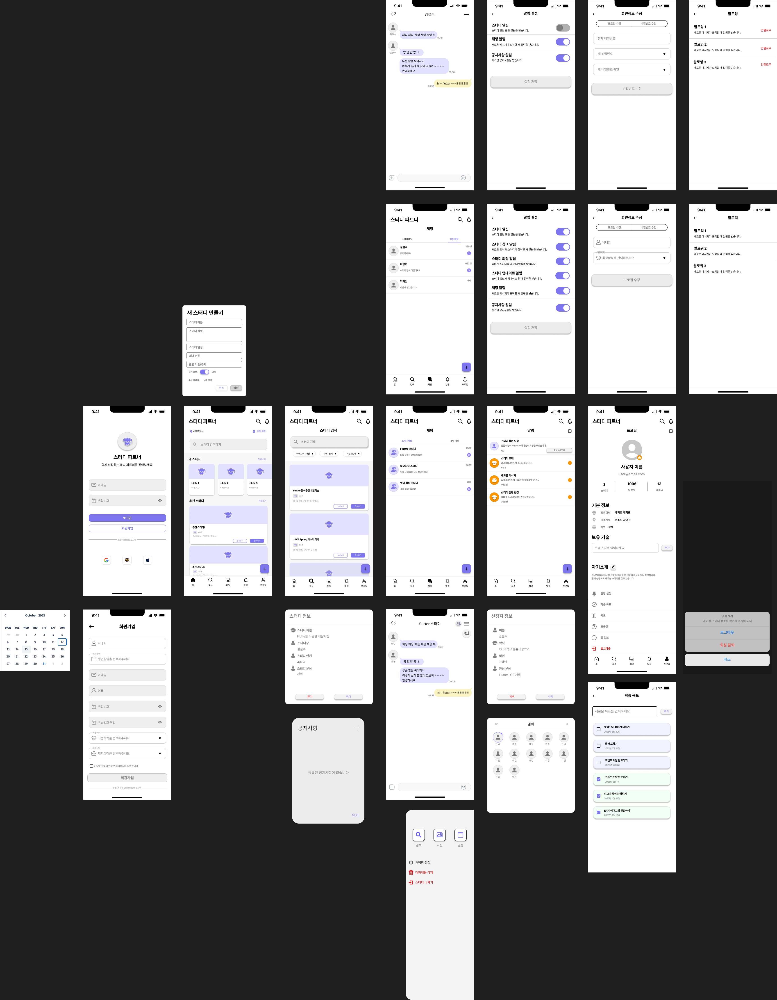

# 스터디 파트너 앱

스터디 파트너 앱은 사용자들이 스터디 그룹을 찾고 관리할 수 있는 플랫폼입니다.



## 프로젝트 구조

```
lib/
├── main.dart                 # 앱의 진입점 및 라우팅 설정
├── screens/                  # 화면 관련 파일들
│   ├── login_screen.dart     # 로그인 화면
│   ├── register_screen.dart  # 회원가입 화면
│   ├── home_screen.dart      # 홈 화면
│   ├── profile_screen.dart   # 프로필 화면
│   ├── chat_screen.dart      # 채팅 목록 화면
│   ├── chat_room_screen.dart # 채팅방 화면
│   ├── notification_screen.dart # 알림 화면
│   ├── study_search_screen.dart # 스터디 검색 화면
│   ├── study_detail_screen.dart # 스터디 상세 화면
│   ├── profile_edit_screen.dart # 프로필 수정 화면
│   ├── notification_settings_screen.dart # 알림 설정 화면
│   ├── map_screen.dart       # 지도 화면
│   ├── todo_screen.dart      # 학습 목표 화면
│   ├── follow_screen.dart    # 팔로우/팔로잉 화면
│   └── user_info_screen.dart # 사용자 정보 화면
└── widgets/                  # 재사용 가능한 위젯들
```

## 주요 기능

### 1. 인증
- 로그인 (`login_screen.dart`)
  - 이메일/비밀번호 로그인
  - 소셜 로그인 (추후 구현 예정)

- 회원가입 (`register_screen.dart`)
  - 닉네임, 생년월일, 이메일, 비밀번호 입력
  - 최종학력 및 재학상태 선택
  - 이용약관 동의

### 2. 홈 화면 (`home_screen.dart`)
- 현재 위치 기반 스터디 검색
- 내 스터디 목록
- 추천 스터디 목록
- 스터디 생성 기능

### 3. 프로필 관리 (`profile_screen.dart`)
- 기본 정보 표시
- 보유 기술 관리
- 자기소개
- 프로필 수정
- 로그아웃

### 4. 스터디 관리
- 스터디 검색 (`study_search_screen.dart`)
  - 카테고리, 지역, 시간대별 필터링
  - 검색 결과 표시

- 스터디 상세 (`study_detail_screen.dart`)
  - 스터디 정보 표시
  - 참여 신청 기능
  - 멤버 목록

### 5. 커뮤니케이션
- 채팅 (`chat_screen.dart`, `chat_room_screen.dart`)
  - 채팅방 목록
  - 실시간 메시지 전송
  - 이미지 공유

- 알림 (`notification_screen.dart`)
  - 스터디 관련 알림
  - 메시지 알림
  - 시스템 알림

### 6. 부가 기능
- 지도 (`map_screen.dart`)
  - 스터디 위치 표시
  - 주변 스터디 검색

- 학습 목표 (`todo_screen.dart`)
  - 목표 설정
  - 진행 상황 추적

- 팔로우/팔로잉 (`follow_screen.dart`)
  - 사용자 팔로우
  - 팔로워/팔로잉 목록

## 기술 스택

- Flutter: UI 프레임워크
- Go Router: 라우팅 관리
- Provider: 상태 관리 (추후 구현 예정)
- Firebase: 백엔드 서비스 (추후 구현 예정)

## 설치 및 실행

1. Flutter SDK 설치
2. 프로젝트 클론
```bash
git clone [repository-url]
```

3. 의존성 설치
```bash
flutter pub get
```

4. 앱 실행
```bash
flutter run
```

## 개발 환경

- Flutter: 3.x
- Dart: 3.x
- IDE: VS Code / Android Studio

## 라이선스

이 프로젝트는 MIT 라이선스를 따릅니다.
